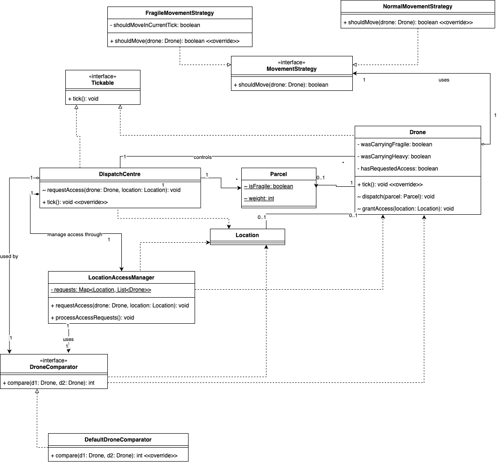

# Autonomous Drone Delivery Simulation Engine

A Java-based discrete-event simulation engine for autonomous drone delivery, featuring scheduling, congestion-aware traffic arbitration, and real-time visualization.

## Highlights

- Discrete-event, tick-driven simulation loop for reproducible experiments
- Modular architecture with separate responsibilities for simulation, dispatch, and drone state transitions
- Conflict-aware location access arbitration with priority + anti-starvation behavior
- Real-time suburb visualization and event logging for observability
- Configurable scenario profiles through property files

## Tech Stack

- Java
- Gradle
- Swing (GUI visualization)

## Project Structure

- `src/main/java/drone` - simulation core, dispatch center, drone logic, suburb model, view, logger
- `src/main/resources/properties` - scenario configuration files
- `src/test/java` - current log baselines / test artifacts

## UML



## Scenarios

Property files under `src/main/resources/properties`:

- `test.properties` - default scenario
- `test_contention.properties` - higher contention scenario
- `test_fragile.properties` - fragile-priority scenario

## How to Run

### Option 1: Run in IDE (recommended)

Run `drone.Main` directly.  
Optional program argument: a properties path, for example:

`properties/test_contention.properties`

If no argument is provided, the app uses:

`properties/test.properties`

### Option 2: Run from terminal

```bash
./gradlew clean classes
java -cp "build/classes/java/main:build/resources/main" drone.Main
```

Run with a specific scenario:

```bash
java -cp "build/classes/java/main:build/resources/main" drone.Main properties/test_fragile.properties
```

## Build & Test

```bash
./gradlew build
./gradlew test
```

## Notes

- The simulation uses seeded randomness for reproducible runs.
- Logging and GUI output help inspect dispatch behavior, congestion, and delivery latency.
